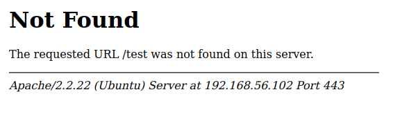
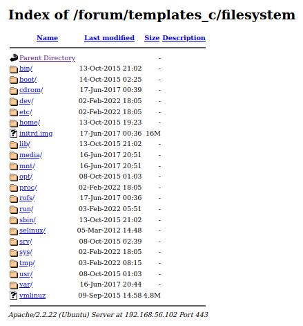

# Apache suEXEC vulnerability.

By going to a non existing website endpoint, we can get Apache version.



> Apparently version `2.2.22` is running this website.

There is a security vulnerability documented [here](https://www.exploit-db.com/exploits/27397) that affects this version. We only need a way to upload a file on the server. Since we succeed to upload a webshell in [Writeup 1, part 2](../../writeup1/part2.md) via PHPMyAdmin, we could start from there once again.

```SQL
SELECT 1, '<?php symlink(\"/\", \"filesystem\");?>' INTO OUTFILE '/var/www/forum/templates_c/suexec_exploit.php'
```

> This script will exploit this vulnerability, since [`httpd`](https://linux.die.net/man/8/httpd) symlinks and directories without querying [suEXEC](https://en.wikipedia.org/wiki/SuEXEC) we'll have the ability to navigate the filesystem.

Now all we have to do is to visit `/forum/templates_c/suexec_exploit.php` endpoint to perform the exploit. Then `/forum/templates_c/filesystem` will be available to look through.



We now have the same result as we got with the webshell and we can follow up with [Writeup 1, part 3](../../writeup1/part3.md).