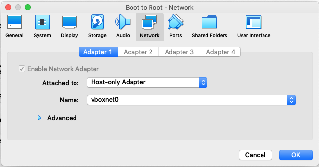

# Setup and get network IP.

When started, the machine asks us for a login, showing nothing but this prompt. Using the **Host Network Manager** from VirtualBox we can setup a local network between all virtual machines and the host one. By doing so, we get an IP that will be later referenced as `<IP>`.

To create an **Host only adapter network**, first we go **File > Host Network Manager** and it opens a pop-up. All we have to do now is clicking on the **Create** button to generate a new network. We get the following:


> In our case, the host network is called `vboxnet0` with `192.168.56.1` as IP address.

Then, we select the Boot to Root machine and go to **Machine > Settings > Network** to set the new network. We put **Attached to** to `Host only Adapter` and we select the option `vboxnet0` for the **Name** option as follow:



# Analyze local network.

Now all we have to do is to scan the network with [`nmap`](https://linux.die.net/man/1/nmaps).

```shell
  $> nmap <IP>/24
  Starting Nmap 7.92 ( https://nmap.org ) at 2022-01-23 12:26 CET
  Nmap scan report for <IP>
  Host is up (0.00033s latency).
  Not shown: 999 closed tcp ports (conn-refused)
  PORT   STATE SERVICE
  22/tcp open  ssh

  Nmap scan report for <NETWORK-IP1>
  Host is up (0.00037s latency).
  All 1000 scanned ports on 192.168.56.100 are in ignored states.
  Not shown: 1000 closed tcp ports (conn-refused)

  Nmap scan report for <NETWORK-IP2>
  Host is up (0.0012s latency).
  Not shown: 994 filtered tcp ports (no-response)
  PORT    STATE SERVICE
  21/tcp  open  ftp
  22/tcp  open  ssh
  80/tcp  open  http
  143/tcp open  imap
  443/tcp open  https
  993/tcp open  imaps

  Nmap done: 256 IP addresses (3 hosts up) scanned in 12.90 seconds
```

> `/24` tells to nmap to scan the range of adresses that fit this mask. In our case from `192.168.56.0` to `192.168.56.255`.

The one we want to connect is `<NETWORK-IP2>`.
