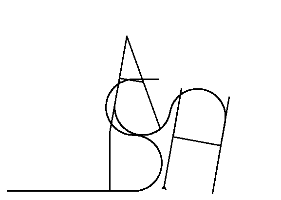

# Turtle am I right?

Two files are in its `home` directory... Once more, a `README` and a text file `turtle`.

```shell
  $> cat README
  Finish this challenge and use the result as password for 'zaz' user.
  $> cat turtle
  ...
  Tourne droite de 1 degrees
  Avance 50 spaces

  Avance 210 spaces
  Recule 210 spaces
  Tourne droite de 90 degrees
  Avance 120 spaces
  ...
  Can you digest the message? :)
```

> The textfile look like a pseudo protocol written in French. After some research we find a python package called [turtle](https://docs.python.org/3/library/turtle.html) that uses the same kind of logic to draw on a canvas. So let's write an interpreter that will convert it to understandable python code that use the turtle module.

```js
const { readFileSync, writeFileSync } = require('fs')
const { execSync } = require('child_process')

const fileData = readFileSync('turtle').toString().split('\n')
const turtleCode = [
  '#!/usr/bin/python3',
  'from turtle import *',
  'pensize(3)',
  'left(90)',
]

for (const line of fileData) {
  const [value] = line.match(/\d+/) || []
  if (line.match(/gauche/)) {
    turtleCode.push(`left(${value})`)
  } else if (line.match(/Avance/)) {
    turtleCode.push(`forward(${value})`)
  } else if (line.match(/droite/)) {
    turtleCode.push(`right(${value})`)
  } else if (line.match(/Recule/)) {
    turtleCode.push(`backward(${value})`)
  }
}

turtleCode.push('delay(1000)', 'forward(0)')
writeFileSync('thor.py', turtleCode.join('\n'))
execSync('python3 thor.py')
```

> This script will go through each line of the file `turtle` and build an array of instruction that will be later converted to a newline separated string output to `thor.py` before interpreting it with `python3`. The last two initial strings in `turtleCode` allow us to set a the turtle facing up with a larger drawing size than default. `delay(1000)`at the end helps us to see the final result because the program shut down the graphic window on the last turtle instruction.

Running the script gives us the following result...

```shell
  $> node turtle-interpreter.js
```



All we have to do now is to hash the word `SLASH` with [`md5sum`](https://man7.org/linux/man-pages/man1/md5sum.1.html).

```shell
  $> echo -n 'SLASH' | md5sum | cut -d ' ' -f1
  646da671ca01bb5d84dbb5fb2238dc8e
```

> `cut -d ' ' -f1` is used to remove the dash following the output.

We now have another credentials pair: `zaz:646da671ca01bb5d84dbb5fb2238dc8e`.