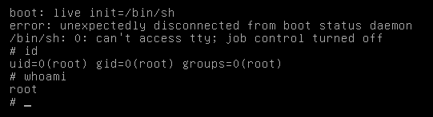

# Recovery mode

Every linux susbsystem has a recovery mode available by pressing a key combination on boot. For this one, `control` + `shift` + `esc` works. Once in recovery mode we have a limited command prompt from which we can call labels. Ones that are configured to boot the machine.

# Syslinux and init daemon.

We need to find how we can boot up the machine through recovery mode. We can see that [`syslinux`](https://linux.die.net/man/1/syslinux) is installed on this machine, meaning there is a `isolinux` config file somewhere. Let's find it.

```shell
  $> file $(find / -type f -xdev -name *isolinux* 2>/dev/null)
  /etc/remastersys/isolinux/isolinux.cfg.vesamenu: ASCII text     
  /usr/lib/syslinux/isolinux-debug.bin:            isolinux Loader
  /usr/lib/syslinux/isolinux.bin:                  data
  /usr/share/doc/syslinux/isolinux.txt.gz:         gzip compressed data, from Unix, max compression
  $> cat /etc/remastersys/isolinux/isolinux.cfg.vesamenu
  default live
  prompt 0
  timeout 0

  menu title __LIVECDLABEL__
  menu background splash.png
  menu color title 1;37;44 £c0ffffff £00000000 std

  label live
    menu label live - boot the Live System
    kernel /casper/vmlinuz
    append  file=/cdrom/preseed/custom.seed boot=casper initrd=/casper/initrd.gz quiet splash --
```

> Once again using [`file`](https://linux.die.net/man/1/file) we can quickly identify the config file since it must be an ASCII text file.

As we can see, there is only one boot option here, the default one called `live`. So no matter what we do, we are forced to use it. With a bit of research we find that the [`init`](https://linux.die.net/man/8/init) deamon is the first process to be executed on boot. Meaning every other process is a child of it **including spawning a new shell**.

Overriding the path in which `init` should go to start normal jobs by the path of a supported shell, since recovery mode is a "root level feature", asking it to launch a shell will give us one with root permissions. If we go back in that recovery mode and try that...



We are indeed root on the machine!